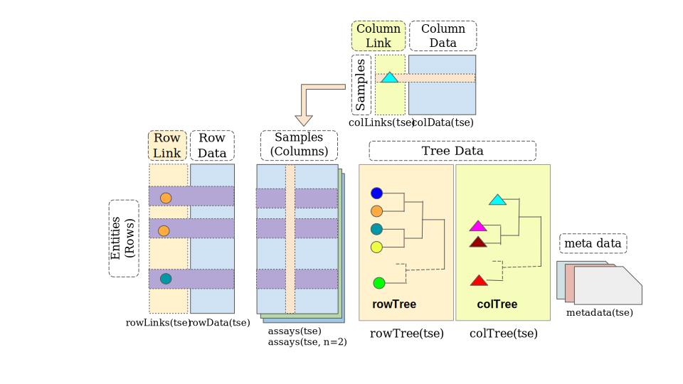

```{r setup, include=FALSE}
knitr::opts_chunk$set(echo = FALSE)
```

## Class structures for microbiome data

The current state

```{r phyloseq_class, echo = FALSE, dpi=72, fig.height=6, fig.width=6, fig.align='right', out.extra = 'style="float:right;"'}
BiocPkgTools::plotClassDepData(readRDS("phyloseq_class.rda"))
```

### `phyloseq`

- slots for 

  - count data
  - taxonomic data
  - sequence data
  - tree data

- no core Bioc classes (11 years in the making)

- similarities to `SummarizedExperiment`

[@R-phyloseq]

## Class structures for microbiome data

### `TreeSummarizedExperiment`

```{r, include=FALSE}
library("TreeSummarizedExperiment")
```

{width=75%}

- adds tree data to `SingleCellExperiment`
- all the benefits of the `SingleCellExperiment` related packages

[@R-TreeSummarizedExperiment]

## Class structures for microbiome data

One thing more: Sequencing data

### Two options

1. Create `MicrobiomeExperiment` inheriting from `TSE`

or 

2. Add `refSeq` slot to `TSE`

Currently this is implemented as 1., but the PR for adding it to `TSE` is
also prepared.

<div style="text-align: center; font-size: 13;"> **Thoughts? Suggestions?** </div>

## Functions for microbiome workflows

Specific functions for working with microbiome data need to be 
added/implemented/wrapped to work with `TSE`.

Current playground is the `mia` package

### Taxonomic data

- key component of microbiome data
- Instead of implementing a special class, on-the-fly subsetting of `rowData`

```{r taxonomyRanks, echo=TRUE, message=FALSE}
library(mia)
data("GlobalPatterns")
se <- GlobalPatterns
taxonomyRanks(se)
head(taxonomyRankEmpty(se, "Species"))
all(!taxonomyRankEmpty(se, "Species"))
```

## Functions for microbiome workflows

`TreeSummarizedExperiment` already contains functions for generating data from
hierarchical tabular data.

`mia` adds wrapper functions

```{r taxonomyTree, echo=TRUE, message=FALSE, warning=FALSE}
taxonomyTree(se)
se <- addTaxonomyTree(se)
```

<div style="text-align: center; font-size: 13;"> **Thoughts? Suggestions?** </div>

## Functions for microbiome workflows

### Using the taxonomic levels

using the alternative experiment slots for aggregating data on taxonomic levels

```{r splitByRanks, echo=TRUE, message=FALSE, warning=FALSE}
altExps(se) <- splitByRanks(se)
altExpNames(se)
```

Analysis can be performed on each taxonomic levels

```{r getPrevalence, echo=TRUE, message=FALSE, warning=FALSE}
altExps(se) <-
   lapply(altExps(se),
          function(y){
              rowData(y)$prevalence <- 
                  getPrevalence(y, detection = 1/100, sort = FALSE,
                                abund_values = "counts", as_relative = TRUE)
              y
          })
```

## Functions for microbiome workflows

### Using the taxonomic levels

Plotting functions split of to `miaViz` package

```{r plotRowTree, echo=TRUE, message=FALSE, warning=FALSE, dpi=72, fig.height=6, fig.width=10}
library(miaViz)
x <- addTaxonomyTree(unsplitByRanks(se))
top_phyla <- getTopTaxa(altExp(se,"Phylum"))
plotRowTree(x[rowData(x)$Phylum %in% top_phyla,], edge_colour_by = "Phylum", 
            tip_colour_by = "prevalence", node_colour_by = "prevalence")
```

<div style="text-align: center; font-size: 13;"> **Thoughts? Suggestions?** </div>

## Sessioninfo

```{r, include=FALSE}
knitr::write_bib(c(.packages(),"phyloseq"),file = "slides.bib")
```
